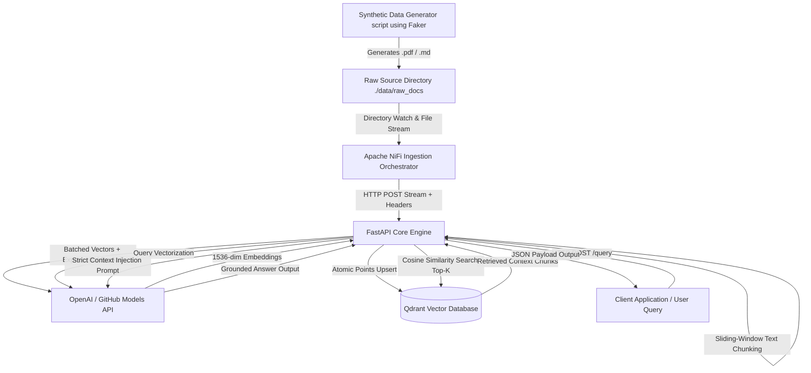

# Enterprise Event-Driven RAG Core Engine

A production-grade, event-driven Retrieval-Augmented Generation (RAG) architecture built to ingest multi-format enterprise unstructured data (PDFs, Markdown, plain text) via Apache NiFi, vectorize content asynchronously via FastAPI into Qdrant, and deliver grounded, zero-hallucination contextual intelligence.


## System Architecture


---

> ⚠️ **Important API & Rate-Limiting Notice:**  
> This project is configured by default to use **GitHub Models API (`models.github.ai`)** for prototyping using a free `GITHUB_TOKEN`. Free-tier API tokens enforce strict rate limits (Requests Per Minute / Tokens Per Minute). Heavy batch processing in Apache NiFi can trigger temporary `429 Too Many Requests` errors. Exponential backoff retry wrappers (`create_embeddings_with_retry`) are implemented in FastAPI to absorb these spikes.  
> 
> **For high-throughput production deployments:** Swap `base_url` in `app/main.py` to standard OpenAI (`api.openai.com`) with a commercial API key or replace it with a local CPU embedding model (e.g., `nomic-embed-text` via Ollama or `FastEmbed`).

---
---

## Key Features & Highlights

* **Event-Driven Data Orchestration:** Automated file ingestion and stream routing using Apache NiFi.
* **Synthetic Data Generation:** Includes a Python utility powered by the `faker` library to generate multi-format test documents (employee handbooks, technical logs, financial reports).
* **Format-Aware Multi-Document Ingestion:** Native binary parsing for `.pdf` documents using `pypdf` alongside standard UTF-8 processing for `.md` and `.txt` files.
* **Fault-Tolerant API Resilience:** Custom exponential backoff retry logic (`create_embeddings_with_retry` & `chat_completion_with_retry`) to handle upstream rate limits without pipeline failures.
* **Batched Vectorization Pipeline:** Reduces network overhead by chunking raw text into sliding windows and executing mini-batch embedding calls.
* **Strict Anti-Hallucination Guardrails:** System prompts enforce maximum determinism (`temperature=0.0`) and restrict answers exclusively to retrieved Qdrant context vectors.
* **Fully Containerized Microservices:** Single-command orchestration using Docker Compose managing FastAPI, Apache NiFi, and Qdrant with volume persistence.

---

## Technology Stack

| Component | Technology / Library | Purpose |
| :--- | :--- | :--- |
| **Data Ingestion Orchestrator** | Apache NiFi | Automated file polling, stream processing, and payload distribution |
| **API Backend Core** | FastAPI, Uvicorn, Pydantic | High-performance asynchronous RESTful API engine |
| **Vector Database** | Qdrant | High-dimensional similarity search and metadata payload storage |
| **Embedding & LLM Provider** | OpenAI API / GitHub Models | Text embeddings (`text-embedding-3-small`) & Chat Completion (`gpt-4o-mini`) |
| **Synthetic Data Generation** | `faker`, `fpdf2` | Utility scripts for producing test `.pdf` and `.md` dataset payloads |
| **Document Processing** | `pypdf`, `io`, Standard Library | PDF stream extraction and character sliding-window chunking |
| **Containerization** | Docker, Docker Compose | Microservice orchestrations and network bridging |

---

## Repository Structure

```text
enterprise-rag-engine/
├── app/
│   ├── main.py              # Core FastAPI engine (ingest, chunk, embed, query)
│   ├── requirements.txt     # Python backend dependencies
│   └── Dockerfile           # FastAPI container definition
├── data/
│   └── raw_docs/            # Directory watched by NiFi for inbound files
├── scripts/
│   └── generate_docs.py     # Data generator using Faker library
├── docker-compose.yml       # Microservice orchestration file
├── .env.example             # Template for environment variables
├── .gitignore
└── README.md
```

---

## Installation & Deployment

### Prerequisites
* [Docker Desktop](https://www.docker.com/products/docker-desktop/) installed and running
* Git installed
* An active GitHub Personal Access Token (or OpenAI API Key)

### Step 1: Clone the Repository
```bash
git clone https://github.com/YOUR_USERNAME/enterprise-rag-engine.git
cd enterprise-rag-engine
```

### Step 2: Environment Configuration
Create a `.env` file in the root directory:

```bash
GITHUB_TOKEN=your_github_ai_token_here
QDRANT_HOST=qdrant
QDRANT_PORT=6333
COLLECTION_NAME=enterprise_knowledge
```

### Step 3: Generate Synthetic Test Data
Run the generator script to populate `./data/raw_docs/` with synthetic test files:

```bash
python scripts/generate_docs.py
```

### Step 4: Build and Launch Container Stack
Spin up all microservices in background mode:

```bash
docker compose up -d --build
```

### Step 5: Access System Interfaces
* **FastAPI Web Docs (Swagger UI):** `http://localhost:8080/docs`
* **Qdrant Vector DB Dashboard:** `http://localhost:6333/dashboard`
* **Apache NiFi Web Interface:** `https://localhost:8443/nifi`

---

## API Reference

### Ingest Document Stream
* **Endpoint:** `POST /ingest`
* **Headers:** `X-Document-Name: employee_handbook.pdf`
* **Body:** Raw Binary / File Stream (`application/octet-stream`)
* **Response:**
```json
{
  "status": "success",
  "chunks_processed": 18,
  "file": "employee_handbook.pdf"
}
```


